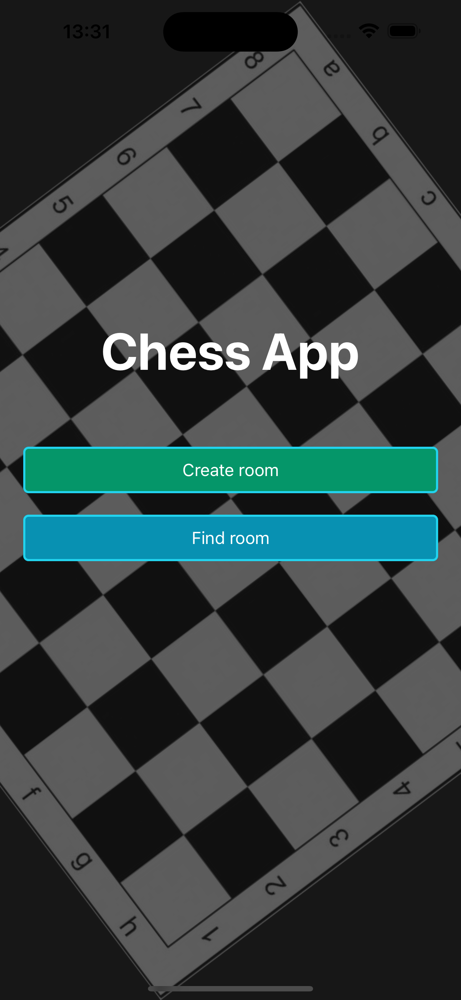

# Chess App
## Beschreibung
Wie der Name schon sagt, ist es eine Schach App,
mit welcher man gegen seine Freunde oder 
auch mit einer fremden Person Schach spielen kann.

### Projektstruktur
Die Projektstruktur ist in folgende Ordner aufgeteilt:
- app
- assets
- components
- services
```
.
├── app
│   ├── find-room
│   │   ├── [nickname].tsx
│   ├── game
│   │   ├── [room].tsx
│   ├── [room].tsx
│   ├── _layout.tsx
│   ├── index.tsx
├── assets
│   ├── *.png
├── components
│   ├── button
│   │   ├── button.tsx
│   ├── chessboard
│   │   ├── chessboard.tsx
│   ├── table
│   │   ├── table.tsx
│   ├── text-input
│   │   ├── textInput.tsx
├── services
│   ├── async-storage-service.ts
│   ├── room-service.ts
│   ├── firebase-config.ts
│   ├── moduls.ts
```
## Funktionalität des Schachspiels
- Raum erstellen
- Raum beitreten
- Nickname eingeben
- Schachbrett (musste ich selber machen)
- Schachfiguren (vom Internet)
- Schachregeln (basic regeln)
  - Figuren bewegen
  - check wenn andere Figuren im Weg sind
  - check ob gewonnen
  - bauer umwandeln (automatisch in Dame)
  - bauer kann am Anfang 2 Felder gehen
  - andere Figuren töten
- Stopuhr (für die Zeit)
- Profilbild (mit Name)
    - Profilbild selbst aufnehmen (wenn man auf sein Profilbild klickt)
- Aufgeben

## Kurzanleitung
1. App starten
2. Nickname eingeben
3. Raum erstellen oder Raum beitreten
4. Schach spielen
5. Gewinnen oder verlieren oder Aufgeben
6. (Profilbild aufnehmen) - indem man auf sein Profilbild klickt

## Firebase
Ich habe Firesbase Realtime Database benutzt, um die Daten zu speichern.

## AsyncStorage
Async storage habe ich nur benutzt um die playerId des benutzers auf dem Gerät zu speichern. Damit ich weiss, welcher Benutzer zu welchem Gerät gehört in der Firestore Realtime Datenbank.
## Sensoren
- Touch (Drag and Drop)
- Kamera (Profilbild aufnehmen)

## Main Technologien
- React Native
- Firebase
- AsyncStorage
- TypeScript
- Expo
- React Navigation

## Figma
Figma: https://www.figma.com/design/TKZNkRyaiqpkSY8Lzjf9zu/Chess-App?node-id=0-1&t=o8DRPSA9TMMLhgQp-1

